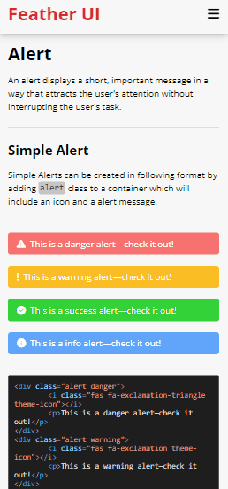

# [Feather-UI](https://feather-design.netlify.app/)

Feather UI is a free-to-use, lightweight component library which can help you develop your website faster by using out predefined components.

---

## Technologies Used

- HTML
- CSS

---

## Installation

To install simple copy and paste below code in your `head` tag of html above all other stylesheets

```
<script src="https://kit.fontawesome.com/bbbaa28fd5.js" crossorigin="anonymous"></script>
<link rel="stylesheet" href="https://feather-design.netlify.app/Components/main.css" />
```

The script tag here is to import the font awesome icon kit used in the library. You can use the icon you want from **[Font Awesome](https://fontawesome.com/v5.15/icons?d=gallery&p=2)** just by adding class names to the `i` tag.

## Components Included

- [Alert](https://feather-design.netlify.app/components/alert/alert)
- [Avatar](https://feather-design.netlify.app/components/avatar/avatar)
- [Badge](https://feather-design.netlify.app/components/badge/badge)
- [Button](https://feather-design.netlify.app/components/button/button)
- [Card](https://feather-design.netlify.app/components/card/card)
- [Colors](https://feather-design.netlify.app/components/colors/colors)
- [Grid](https://feather-design.netlify.app/components/grid/grid)
- [Image](https://feather-design.netlify.app/components/image/image)
- [Input](https://feather-design.netlify.app/components/input/input)
- [List](https://feather-design.netlify.app/components/list/list)
- [Modal](https://feather-design.netlify.app/components/modal/modal)
- [Navigation](https://feather-design.netlify.app/components/navigation/navigation)
- [Rating](https://feather-design.netlify.app/components/rating/rating)
- [Toast](https://feather-design.netlify.app/components/toast/toast)
- [Text Utilities](https://feather-design.netlify.app/components/utilities/utility)

---

## Usage

To use any components copy the code snippet given below each example from the documentation website.
Some of the components use Javascript for functionality. Although Feather UI does not provide Javascript, code snippets for Javascript are provided.

## Desktop Demo


## Mobile Demo


